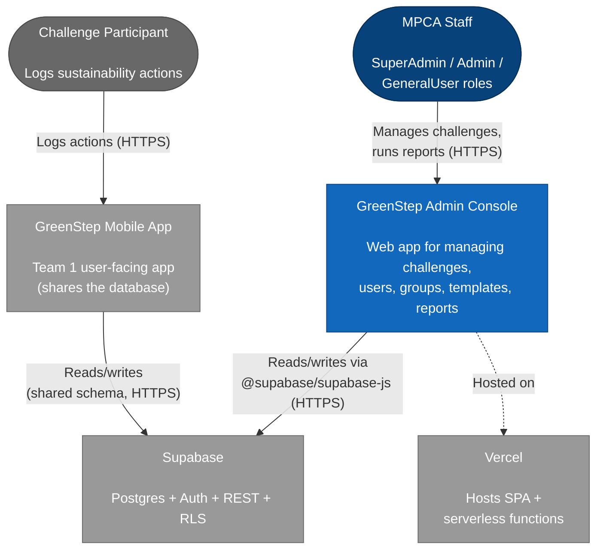
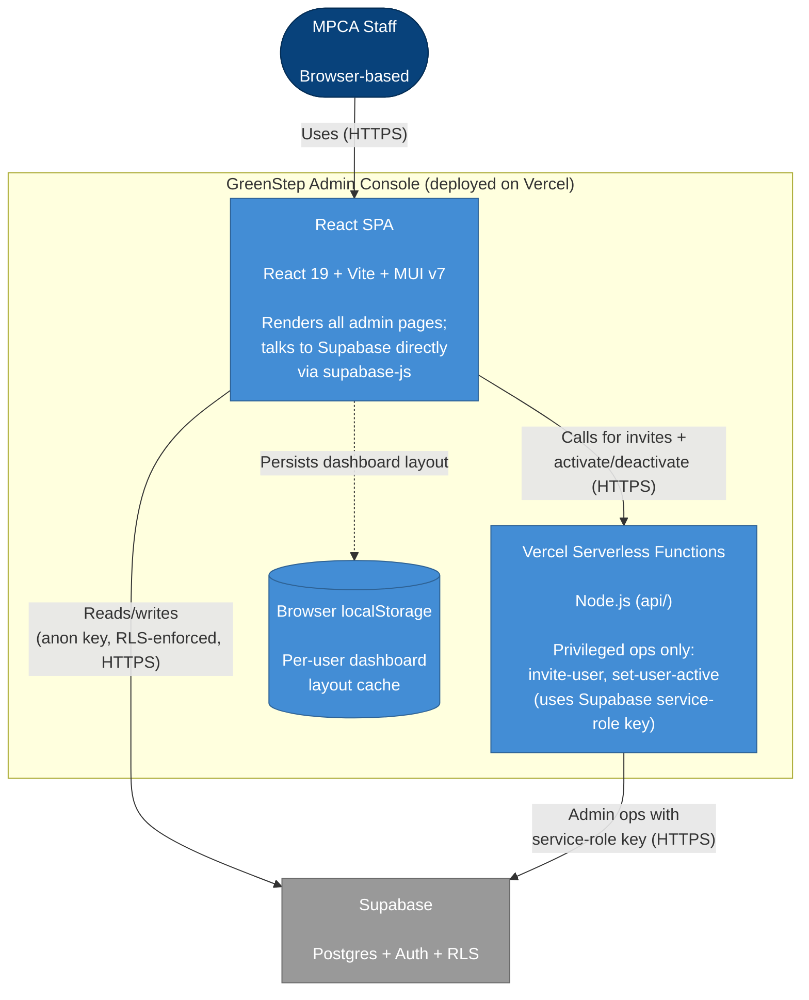
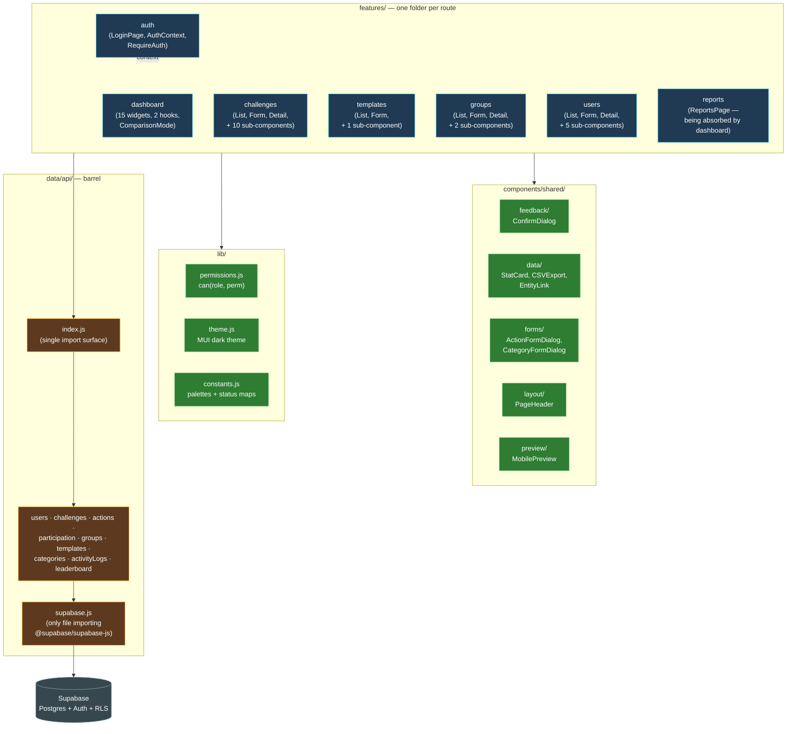

# Architecture Diagrams (C4)

> Source-of-truth diagrams for the GreenStep Admin Console. Mermaid is the
> canonical format; update *here* when architecture changes, not in slides.
>
> An older image-based snapshot lives in
> [Issue #4](https://github.com/CISC-480-GreenStep/sp26_team2_greenstepchallenge_admin/issues/4)
> from before the FastAPI → Supabase migration; treat that as historical.

---

## L1 — System Context

Who interacts with the system, and which neighbouring systems it talks to.

---

## L2 — Containers

Deployable units inside the Admin Console boundary.

**Key design decision (called out for the rubric):** the SPA talks to Supabase
directly using the anon key. Authorization isn't enforced in the React code —
it lives in **Postgres Row-Level Security policies** keyed off the JWT role
claim. That's why we don't need a separate backend API container.

---

## L3 — Components inside the React SPA

How the SPA is organized internally. Matches the source tree under
`src/admin-app/src/`.

### Verified architectural invariants

These are the rules that keep the diagram clean. All currently hold:

1. **Only `data/supabase.js` imports `@supabase/supabase-js`.** Verified by
   grep (1 match).
2. **No component bypasses the `data/api` barrel** to import a sub-module
   directly. Verified by grep (0 matches).
3. **Cross-feature components live in `components/shared/`.** As of this PR,
   no feature folder imports another feature's components.
4. **`lib/` stays small.** 3 files: `constants.js`, `permissions.js`,
   `theme.js`. No feature-specific code.

### What this view intentionally simplifies

- The 15 dashboard widgets are not drawn individually — see
  `features/dashboard/config/widgets.js` for the registry.
- Per-feature internal sub-components are summarized as a count; the source
  tree in [`ARCHITECTURE.md`](./ARCHITECTURE.md) §3 lists each one.
- The `reports/` feature is shown but flagged for absorption into `dashboard/`
  (tracked in [issue #40](https://github.com/CISC-480-GreenStep/sp26_team2_greenstepchallenge_admin/issues/40)).

---

## When to update this file

- A new top-level feature folder is added or removed under `features/`
- A shared component category (`feedback`, `data`, `forms`, `layout`,
  `preview`) is added or removed
- The "SPA talks to Supabase directly" invariant changes (e.g. introducing a
  middle-tier API)
- A new external system enters the picture (e.g. Supabase Storage for photos,
  a notification provider, etc.)
